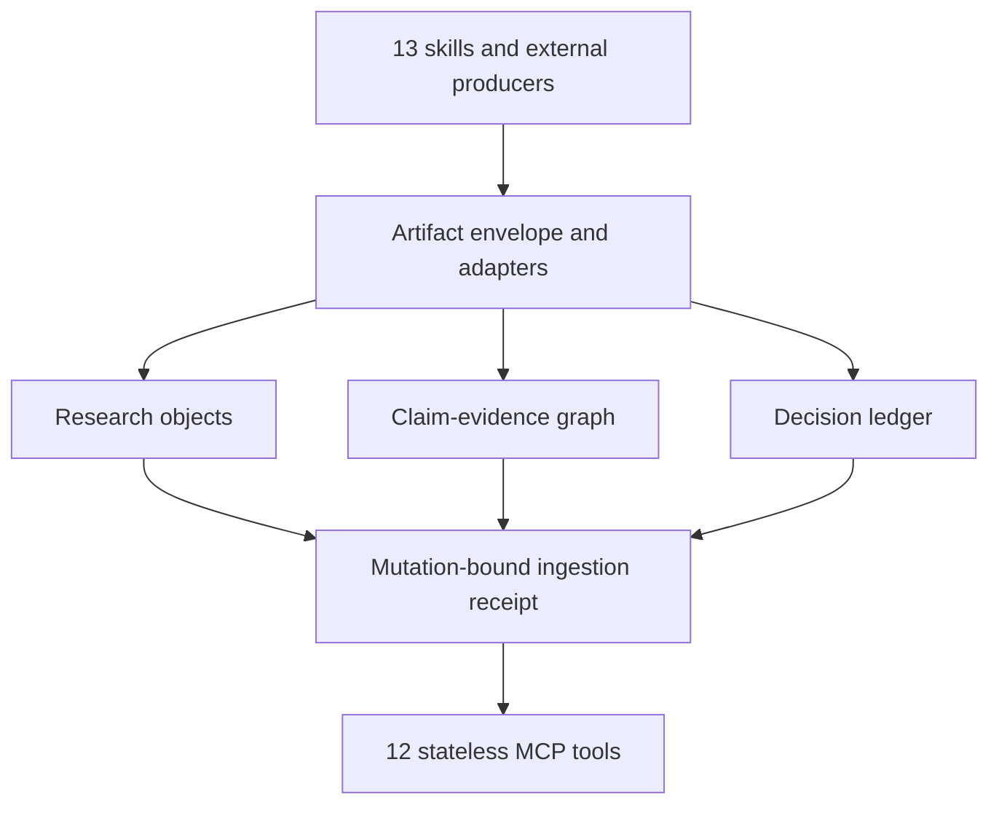

# Research-State Kernel Architecture & Ingestion Bridge

## Overview

The **Academic Research Kernel** provides an offline-first, deterministic, cryptographically verifiable research-state runtime for autonomous AI agents and scholars.

Rather than treating tools as disconnected utility scripts, the kernel unifies 13 specialized scholarly capabilities around three core state models and a centralized ingestion bridge:

---

## The Three Core State Layers

1. **Research Object Identity & Lineage (`skills/research-object-identity`)**:
   - Discrete, rule-based equivalence judgments (EXACT, STRONG_MATCH, CANDIDATE, CONFLICT, UNRESOLVED) with zero opaque similarity scores;
   - Cryptographic `LineageReceipt` anchors tracking entity derivation and activity history.
2. **Claim-Evidence Graph (`skills/claim-evidence-graph`)**:
   - Directed tripartite graph connecting Claims, Evidence Anchors, and Support/Refutation Edges;
   - Physical payload SHA-256 verification via `ReceiptRef`.
3. **Decision & Negative Result Ledger (`skills/decision-ledger`)**:
   - Append-only event sourcing (`DecisionStateEvent`) driving active, pruned, and reopened route transitions;
   - Content-addressed outcome corrections and explicit failure recording without in-place updates.

---

## Research Artifact Ingestion Bridge v1

The Ingestion Bridge (`scripts/ingestion/`) is the universal translation layer that ingests structured outputs from tools into the kernel through staged, atomic state mutations.

Every public ingestion path executes the repository's Draft 2020-12 JSON Schemas at runtime. Envelope identity, payload hash, producer-major compatibility, payload size/depth/cardinality bounds, and adapter routing are checked before planning. Unknown structured contracts fail closed; only the explicit opaque fallback stores an unknown artifact without claiming structured interoperability.

Batch execution is transactional. Plans run against a detached state clone, every intermediate CEG/Ledger/kernel invariant is checked, and cache entries become visible only with the final commit. Idempotency keys include the complete mutation context (producer, kind, schema, subjects, lineage, locator, and bindings), so a replay cannot be incorrectly shared across a different target state or routing context. Caller metadata is retained for audit correlation but deliberately excluded from mutation identity.

### Ingestion Adapters (3 Tiers)

- **Tier 1: Native Structured Receipts (Lossless)**
  - `academic-source-verification`: Ingests `AcademicEvidenceReceipt`, registers works, populates CEG claims and evidences with physical payload hashes.
  - `research-object-identity`: Pass-through ingestion for canonical research objects and lineage receipts.
  - `claim-evidence-graph`: Validates and merges CEG sub-graphs.
  - `decision-ledger`: Validates and replays Decision Ledger snapshots.
- **Tier 2: Structured Analytical Artifacts**
  - `quantitative-paper-audit`: Recomputes statistics; verified/discrepant calculations enter as CEG evidence anchors.
  - `research-reproducibility`: Ingests reproduction attempts; inconclusive results emit uncertainty findings.
  - `cross-review-five`: Ingests multi-agent review findings; dissenting opinions are strictly preserved as uncertainties (never squashed by majority vote).
  - `systematic-review-meta-analysis`: Ingests screening matrices and pooled effect sizes.
  - `literature-analysis`: Ingests canonical work matrices.
  - `literature-watch`: Ingests monitoring deltas without mutating decision states.
  - `retraction-watch`: Signals retraction alerts and marks affected evidence as requiring revalidation (never deletes history).
  - `math-computation`: Ingests symbolic/numerical evaluations.
- **Tier 3: Opaque Artifacts (Prose Stays Prose)**
  - `academic-writing`: Manuscripts, submission packages, and drafts are stored with cryptographic hashes. The kernel **strictly forbids** extracting speculative claims or making automated decisions from unannotated prose.

### Tamper-Evident Kernel State

`IngestionKernelState` serializes the complete CEG, decision ledger, research-object registry, physical receipt registry, kernel uncertainty queue, ingested-artifact registry, and semantic receipt cache. Each first-class registry has a deterministic digest; those digests roll into `kernel_content_digest`, while the complete transport object carries a separate `snapshot_digest`. Strict loaders verify declared graph/ledger/lineage/receipt digests, replay invariants, and snapshot identity before accepting state.

All envelope, receipt, object, uncertainty, CEG, ledger, and lineage metadata is recursively frozen inside domain objects. Serialization returns detached mutable copies, preventing callers from changing content-addressed state through a retained nested dictionary.

### Complete semantic mutation commitments

An accepted `ArtifactIngestionReceipt` contains immutable `mutation_bindings`, each with `kind`, `identity` and `canonical_digest`. The digest uses the kernel's canonical JSON rules. Bindings cover newly created and adopted records; matching an ID alone never proves replay integrity. Re-signing an outer snapshot cannot hide a changed bound record. These are integrity commitments, not authenticated signatures from an external trust authority.

| State | Committed semantics |
| --- | --- |
| ResearchObjects, including opaque artifacts | Full canonical record: payload, identifiers, producer, locator, metadata and context |
| CEG | Container protocol/identity plus every adopted Claim, EvidenceAnchor, SupportEdge and ClaimRelation |
| Decision Ledger | Container protocol/identity plus decisions, bases, forks, state events and corrections; an empty ledger needs no invented record |
| Uncertainty | Item identity and full canonical record, distinguishing adapter declarations, domain projections and unrelated historical entries |
| Physical receipts | Registry key and full payload, including a zero-claim receipt whose registration is its only scientific mutation |
| Artifact/context/lineage | Artifact payload commitment, complete mutation-context digest, source reference and any available physical lineage receipt |

Containers commit identity separately from their record sets so later append-only mutations do not invalidate earlier receipts. Adapter warnings are retained unchanged. A domain-derived uncertainty may leave the live queue only when independent recomputation shows its causal condition has disappeared; its historical receipt remains unchanged. The only ResearchObject upgrade exception is the exact minimal `{id, kind: work}` placeholder to a schema-valid canonical work, attested by its own accepted literature ingestion. Arbitrary replacement is forbidden. Physical lineage emission timestamps use the existing explicitly defined receipt-equivalence rule; semantic payload fields remain bound.

Pre-closeout experimental ingestion caches without complete bindings fail closed and require reingestion; they are not silently treated as verified. Persisted CEG/Ledger historical hash modes remain supported. Current `evidence-receipt-1.0` admission uses the full producer schema. The explicit `academic-evidence-1.0` compatibility alias uses `legacy-academic-evidence.schema.json` for the historical compact receipt shape; physical consumers recognize that same closed shape, and any supplied claim digest must match the complete canonical claim.

### Trusted lineage verification context

Portable receipts contain evidence, never filesystem authority. `LineageVerificationContext` is an immutable invocation argument carrying a trusted content root, exact authorized paths or entity-indexed bytes and a maximum byte budget. Trusted Python producers, adapters, CEG/Ledger replay and `IngestionKernelState.from_dict(..., verification_context=...)` use this same context. It is excluded from serialized receipts and snapshots. The historical trusted absolute-locator producer API authorizes only the exact explicitly supplied files; it does not grant directory-wide authority.

The default content budget is 10 MiB. Trusted callers can explicitly authorize a larger budget for datasets. Producer and verifier share the bounded verification algorithm, so the producer cannot claim content verification that the same policy cannot reproduce. Missing content, hash mismatch, unavailable authority, unchecked mode and exceeded budget remain distinct reasons. Without content authority, a serialized `fully_verified` claim fails verification deterministically; it does not authorize an ambient host read. Replaying a snapshot containing such a claim likewise requires explicit authority. Root traversal and symlink escape fail containment checks.

MCP accepts base64 `content_payloads` indexed by entity ID on the seven content-consuming tools. The wire limit is fixed at 10 MiB unless trusted host configuration supplies a larger context. Wire arguments cannot nominate a root, authorize paths or increase the budget. Malformed registries and domain construction are inside the structured input-validation boundary across all twelve tools; preflight dry-run admission catches errors already knowable at validation time.

---

## Universal MCP Interface (12 Tools)

The stdio MCP server ([scripts/mcp_server.py](../scripts/mcp_server.py)) exposes the deterministic kernel directly to Claude Code, Cursor, Codex, Gemini CLI, and Hermes:

1. `research_artifact_validate`: Runs the same envelope, registry, planning, dry-run apply and invariant checks as admission against the supplied state and bindings.
2. `research_artifact_ingest`: Ingests envelope into kernel state and emits an `ArtifactIngestionReceipt`.
3. `research_receipt_verify`: Verifies physical receipt payloads against `ReceiptRef`.
4. `research_object_resolve`: Resolves candidate records to canonical objects.
5. `research_lineage_trace`: Traces provenance ancestry.
6. `claim_evidence_validate`: Validates CEG integrity and cycles.
7. `claim_evidence_trace`: Traces evidence and receipts for a claim.
8. `decision_ledger_validate`: Executes four-gate verification on a decision ledger.
9. `decision_trace`: Traces causal ancestry and corrections for a decision.
10. `academic_recompute_statistics`: Recomputes statistical claims (t-tests, effect sizes).
11. `academic_check_percentage`: Checks count/percentage compatibility.
12. `academic_scfabric_hardware_probe`: Probes execution accelerators.

Tool arguments use closed JSON Schemas and are validated before dispatch. Each response sets MCP `isError` consistently, and `research_artifact_ingest` accepts and returns a complete kernel snapshot rather than a lossy projection. The stdio surface is covered by an actual subprocess initialize → tools/list → tools/call exchange.

---

## Verification and residual boundaries

The remediation baseline is **819 passed, zero skipped** tests plus 40 executable documentation fences. Cross-platform CI covers Python 3.10–3.14, Linux x86_64/ARM64, Windows x86_64/ARM64, macOS ARM64/Intel, Ubuntu 26.04 canaries, and current-upstream loading.

The complete historical PR/CI ledger, fixed PR #12 review findings, and still-open operational/governance/P3 boundaries are maintained in [the 2026-09-20 project lineage audit](project-lineage-audit-20260920.md).

Final candidate SHA/tree, exact-head CI and cumulative review evidence are bound in the [closeout ledger](https://github.com/xngg1021/academic-research-kernel/pull/12#issuecomment-5750357151); historical CI is not substituted for the new candidate.
